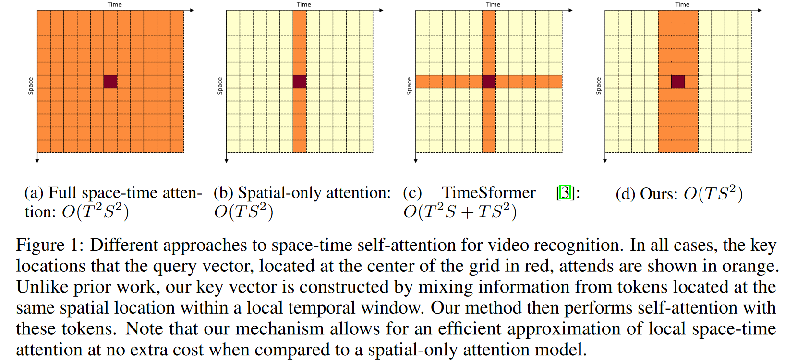

# XViT - Space-time Mixing Attention for Video Transformer

This is the official implementation of the [XViT paper](https://arxiv.org/pdf/2106.05968):

```BibTeX
@inproceedings{bulat2021space,
  title={Space-time Mixing Attention for Video Transformer},
  author={Bulat, Adrian and Perez-Rua, Juan-Manuel and Sudhakaran, Swathikiran and Martinez, Brais and Tzimiropoulos, Georgios},
  booktitle={NeurIPS},
  year={2021}
}
```

In XViT, we introduce a novel Video Transformer model the complexity of which scales linearly with the number of frames in the video sequence and hence induces _no overhead_ compared to an image-based Transformer model. To achieve this, our model makes two approximations to the full space-time attention used in Video Transformers: (a) It restricts time attention to a local temporal window and capitalizes on the Transformer's depth to obtain full temporal coverage of the video sequence. (b) It uses efficient space-time mixing to attend _jointly_ spatial and temporal locations without inducing any additional cost on top of a spatial-only attention model. We also show how to integrate 2 very lightweight mechanisms for global temporal-only attention which provide additional accuracy improvements at minimal computational cost. Our model produces very high recognition accuracy on the most popular video recognition datasets while at the same time is significantly more efficient than other Video Transformer models.




## Model Zoo

We provide a series of models pre-trained on Kinetics-600 and Something-Something-v2.

### Kinetics-600

| Architecture | frames | views | Top-1  | Top-5  | url                                  |
| ------------ | ------ | ----- | ------ | ------ | ------------------------------------ |
| XViT-B16     | 16     | 3x1   | 84.51% | 96.26% | [model](https://www.adrianbulat.com/downloads/NeurIPS2021/models/xvit_b16_16_k600.pth) |
| XViT-B16     | 16     | 3x2   | 84.71% | 96.39% | [model](https://www.adrianbulat.com/downloads/NeurIPS2021/models/xvit_b16_16_k600.pth) |

### Something-Something-V2

| Architecture | frames | views | Top-1  | Top-5  | url                                  |
| ------------ | ------ | ----- | ------ | ------ | ------------------------------------ |
| XViT-B16     | 16     | 32x2  | 67.19% | 91.00% | [model](https://www.adrianbulat.com/downloads/NeurIPS2021/models/xvit_b16_16_ss2.pth) |

## Installation

Please make sure your setup satisfies the following requirements:

## Requirements

Largely follows the original SlowFast repo requirements:
- Python >= 3.8
- Numpy
- PyTorch >= 1.3
- hdf5
- [fvcore](https://github.com/facebookresearch/fvcore/): `pip install 'git+https://github.com/facebookresearch/fvcore'`
- [torchvision](https://github.com/pytorch/vision/) that matches the PyTorch installation.
  You can install them together at [pytorch.org](https://pytorch.org) to make sure of this.
- simplejson: `pip install simplejson`
- GCC >= 4.9
- PyAV: `conda install av -c conda-forge`
- ffmpeg (4.0 is prefereed, will be installed along with PyAV)
- PyYaml: (will be installed along with fvcore)
- tqdm: (will be installed along with fvcore)
- iopath: `pip install -U iopath` or `conda install -c iopath iopath`
- psutil: `pip install psutil`
- OpenCV: `pip install opencv-python`
- torchvision: `pip install torchvision` or `conda install torchvision -c pytorch`
- tensorboard: `pip install tensorboard`
- PyTorchVideo: `pip install pytorchvideo`
- [Detectron2](https://github.com/facebookresearch/detectron2):

```
    pip install -U torch torchvision cython
    pip install -U 'git+https://github.com/facebookresearch/fvcore.git' 'git+https://github.com/cocodataset/cocoapi.git#subdirectory=PythonAPI'
    git clone https://github.com/facebookresearch/detectron2 detectron2_repo
    pip install -e detectron2_repo
    # You can find more details at https://github.com/facebookresearch/detectron2/blob/master/INSTALL.md
```

## Datasets

**1. Kenetics**

You can download Kinetics 400/600 datasets following the instructions provided by the cvdfundation repo: https://github.com/cvdfoundation/kinetics-dataset

Afterwars, resize the videos to the shorte edge size of 256 and prepare the csv files for training, validation in testting: `train.csv`, `val.csv`, `test.csv`. The formatof the csv file is:

```
path_to_video_1 label_1
path_to_video_2 label_2
...
path_to_video_N label_N
```

Depending on your system, we recommend decoding the videos to frames and then packing each set of frames into a h5 file with the same name as the original video.

**2. Something-Something v2**

You can download the datasets from the authors webpage: https://20bn.com/datasets/something-something

Perform the same packing procedure as for Kinetics.

## Usage

### Training

```bash
python tools/run_net.py \
  --cfg configs/Kinetics/xvit_B16_16x16_k600.yaml \
  DATA.PATH_TO_DATA_DIR path_to_your_dataset
```

### Evaluation

```bash
python tools/run_net.py \
  --cfg configs/Kinetics/xvit_B16_16x16_k600.yaml \
  DATA.PATH_TO_DATA_DIR path_to_your_dataset \
  TEST.CHECKPOINT_FILE_PATH path_to_your_checkpoint \
  TRAIN.ENABLE False \
```

## Acknowledgements

This repo is built using components from [SlowFast](https://github.com/facebookresearch/SlowFast) and [timm](https://github.com/rwightman/pytorch-image-models)

## License

XViT code is released under the [Apache 2.0 license](LICENSE).